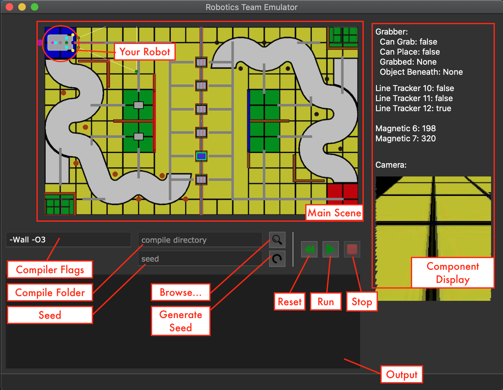

# A Brief Guide to the Emulator

[](https://hackmd.io/@TrebledJ/BJWg_E78D)
[](https://hackmd.io/@TrebledJ/S1Zh67hOv)

## Getting Started

### Watch the Repo 👀
Please click the **Watch** indicator at the top right. We recommend you select **Releases only** from the dropdown. This will notify you of any new releases. We will be continuously adding new features and fixing bugs, so it's important to stay up-to-date.

### Emulator GUI 🖼

Here is the general layout of the Emulator from the macOS perspective.
 

For now, we'll only be using the left side of the field (i.e. Blue Field). On the top left, you can see various components in different colours attached to the robot.

Some features have not been implemented yet. Scroll down to the Road Map to see which features will be coming up.

### Coding 🖥

1. You can download the starter code above to get started.
2. Write your code in an IDE of your own choice. Your code may span multiple files and may contain subdirectories.
3. In the Emulator, select a folder which contains the code.
4. Press the Run button. This will compile all the `.c` within the selected folder into an executable, which will then be run. See the subsection below for details about the compiler.
5. If the code compiles successfully, you should see the simulation running.

#### Compiler
On Windows, gcc is used. On macOS, clang is used.

You can check if you have a certain compiler by opening the terminal or command-line and entering `<compiler> -v` (e.g. `gcc -v`). If you don't have the appropriate compiler installed in your directory, read the instructions below.

#### Windows / gcc

To be able to run and compile your code on the emulaotor, you need to install the gcc compiler. 

Download the setup file from [Sourceforge](https://sourceforge.net/projects/mingw-w64/files/Toolchains%20targetting%20Win32/Personal%20Builds/mingw-builds/installer/mingw-w64-install.exe/download).

Run the setup. When asked to specify setup settings, choose

```
Version: 8.1.0
Architecture: x86_64
Threads: posix
Exception: seh
Build revision: 0
```

**Copy down your destination path.** We will need to use it.

Verify that you can access the destination path and there is a mingw64 folder in there.

Go to your Windows Search Bar and find Edit Environment Variables. On the window that opens, press Environment Variables button. 

On the dialog, select the Path user variable and press edit. On the new dialog, press New to add a new path, the path should be what you copied down **appended with mingw64\bin** (For example, if you installed in the path `C:\Program Files\mingw-w64\x86_64-8.1.0-posix-seh-rt_v6-rev0`, the new path variable should be `C:\Program Files\mingw-w64\x86_64-8.1.0-posix-seh-rt_v6-rev0\mingw64\bin`.)

#### macOS / clang

Open the terminal and enter the following command:

```
xcode-select --install
```

You'll be asked confirm and agree with a license.

### Road Map 🗺

Here is a list of things that are planned to be implemented as new features. The dates indicated are tentative.

Versions with odd minor versions (v1.1, v1.3, v1.5) will be used for bugfix releases. These will be skipped if nothing needs to be fixed.

#### v1.2 (Nov. 23)
* Throwing Mechanism
* Seeding
* Motor/Sensor Noise

#### v1.4 (Dec. 7)
* Timer / Clock Feature
* Multi-Grab

#### v1.6 (Dec. 21)
* Points Tracker
* Violation Detector

### Further Notes 📝

* Note that the Emulator may consume a lot energy.
